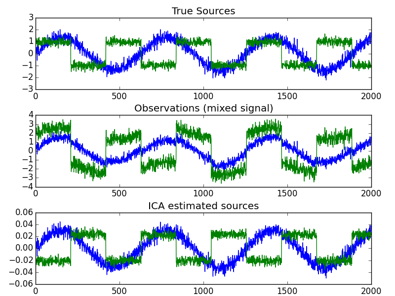
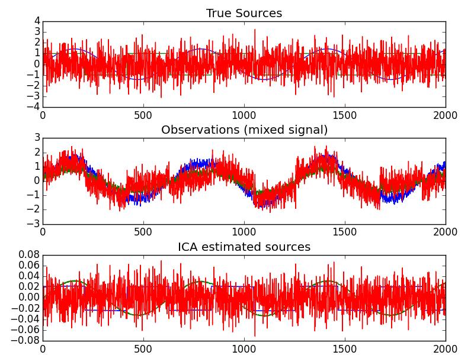

## Test データ×Fast ICA (sklearn)
testデータでFast ICAを適用  
###参考  

*  [Sklean Fast ICAリファレンス](http://scikit-learn.org/stable/modules/generated/sklearn.decomposition.FastICA.html)
* [Blind source separating example with sklearn](http://scikit-learn.org/stable/auto_examples/decomposition/plot_ica_blind_source_separation.html)


##生成源2つ，ノイズ有りのデータの復元
###全コード

```
#coding: utf-8
import numpy as np
import scipy as sp
import pylab as pl
from sklearn.decomposition import FastICA


# Generate sample data
np.random.seed(0)
n_samples = 2000
time = np.linspace(0, 10, n_samples)
s1 = np.sin(2 * time)  # Signal 1 : sinusoidal signal
s2 = np.sign(np.sin(3 * time))  # Signal 2 : square signal
S = np.c_[s1, s2]
S += 0.2 * np.random.normal(size=S.shape)  # Add noise

S /= S.std(axis=0)  # Standardize data

# Mix data
A = np.array([[1, 1], [0.5, 2]])  # Mixing matrix
X = np.dot(S, A.T)  # Generate observations
# Compute ICA
ica = FastICA()
S_ = ica.fit(X).transform(X)  # Get the estimated sources
A_ = ica.mixing_  # Get estimated mixing matrix
assert np.allclose(X, np.dot(S_, A_.T) + ica.mean_)

###############################################################################
# Plot results
pl.figure()
pl.subplot(3, 1, 1)
pl.plot(S)
pl.title('True Sources')
pl.subplot(3, 1, 2)
pl.plot(X)
pl.title('Observations (mixed signal)')
pl.subplot(3, 1, 3)
pl.plot(S_)
pl.title('ICA estimated sources')
pl.subplots_adjust(0.09, 0.04, 0.94, 0.94, 0.26, 0.36)
pl.show()
```

###データの生成

```
# Generate sample data
np.random.seed(0)
n_samples = 2000
time = np.linspace(0, 10, n_samples)
s1 = np.sin(2 * time)  # Signal 1 : sinusoidal signal
s2 = np.sign(np.sin(3 * time))  # Signal 2 : square signal
S = np.c_[s1, s2]
S += 0.2 * np.random.normal(size=S.shape)  # Add noise

S /= S.std(axis=0)  # Standardize data
```

###生成行列Aを決めうちして観測信号Xを生成

```
# Mix data
A = np.array([[1, 1], [0.5, 2]])  # Mixing matrix
X = np.dot(S, A.T)  # Generate observations
```

###Fast ICAの実行

```
# Compute ICA
ica = FastICA()
S_ = ica.fit(X).transform(X)  # Get the estimated sources
A_ = ica.mixing_  # Get estimated mixing matrix
assert np.allclose(X, np.dot(S_, A_.T) + ica.mean_)
```

###結果のプロット

```
# Plot results
pl.figure()
pl.subplot(3, 1, 1)
pl.plot(S)
pl.title('True Sources')
pl.subplot(3, 1, 2)
pl.plot(X)
pl.title('Observations (mixed signal)')
pl.subplot(3, 1, 3)
pl.plot(S_)
pl.title('ICA estimated sources')
pl.subplots_adjust(0.09, 0.04, 0.94, 0.94, 0.26, 0.36)
pl.show()
```



##データソースを3つに増やして同様に
###データソースS, 生成行列A，観測成分Xの生成部分（後は一緒）

```
# Generate sample data
np.random.seed(0)
n_samples = 2000
time = np.linspace(0, 10, n_samples)
s1 = np.sin(2 * time)  # Signal 1 : sinusoidal signal
s2 = np.sign(np.sin(3 * time))  # Signal 2 : square signal
s3 = np.random.normal(size=time.shape)
S = np.c_[s1, s2, s3]
#S += 0.2 * np.random.normal(size=S.shape)  # Add noise

S /= S.std(axis=0)  # Standardize data

# Mix data
A = np.array([[1, 0.2, 0.2], [0.5, 0.1, 0.2], [0.5, 0.5, 0.5]])  # Mixing matrix
X = np.dot(S, A.T)  # Generate observations
```

###結果

